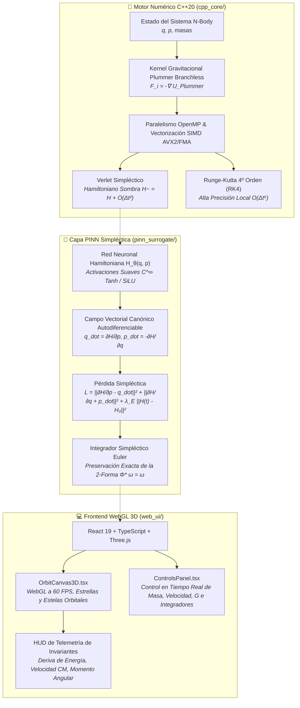

# 🪐 OrbiSim-3D: Motor N-Body de Alto Rendimiento & Capa PINN Simpléctica

[](#)
[](README.md)
[](LICENSE)
[](https://isocpp.org/)
[](https://pytorch.org/)
[](https://react.dev/)
[](https://threejs.org/)
[](#-pruebas-automatizadas-en-navegador--visual-qa)
[](https://github.com/moises-inc?tab=projects)

> **Motor de Integración Numérica para Mecánica Celeste de Alto Rendimiento con Redes Neuronales Informadas por la Física (PINNs Simplécticas) y Visualización WebGL 3D Interactiva.**  
> Componente insigne (**Flagship App #1**) de **Proyecto Tennessee** (*Portafolio de Astroinformática & Computación Científica*) por **Moisés Amundarain** (*Laboratorio LIRIA / Universidad San Sebastián*).

👉 **[Click here to read the English version / Haga clic aquí para la versión en Inglés](README.md)**

---

## 📌 Arquitectura General del Sistema



---

## 🔬 Fundamentos Matemáticos y Físicos

### 1. Mecánica Celeste N-Body con Suavizado de Plummer
Las fuerzas interpartícula gravitacionales se suavizan mediante el potencial de la esfera de Plummer con longitud de escala $\epsilon > 0$ para prevenir singularidades en aproximaciones cercanas:

$$U(r_1, \dots, r_N) = - \sum_{i < j} \frac{G m_i m_j}{\sqrt{\|\vec{r}_j - \vec{r}_i\|^2 + \epsilon^2}}$$

$$\vec{a}_i = -\frac{1}{m_i} \nabla_{\vec{r}_i} U = \sum_{j \neq i} \frac{G m_j (\vec{r}_j - \vec{r}_i)}{\left(\|\vec{r}_j - \vec{r}_i\|^2 + \epsilon^2\right)^{3/2}}$$

**Vectorización SIMD sin Bifurcaciones (*Branchless*):** Para la auto-interacción ($j = i$), $(\vec{r}_i - \vec{r}_i) = \mathbf{0}$, garantizando que el término evalúa idénticamente a $\mathbf{0}$. Esto elimina la condición `if (i == j) continue`, permitiendo que el compilador ejecute instrucciones continuas AVX2/FMA sobre los registros vectoriales sin detener el pipeline.

### 2. Geometría Simpléctica y Conservación de Invariantes
El espacio de fase $\mathcal{M} = \mathbb{R}^{2d}$ está dotado de la 2-forma simpléctica diferencial canónica:

$$\omega = \sum_{k=1}^d dq_k \wedge dp_k$$

- **Simplectididad Exacta:** La transformación de evolución temporal $\Phi_{\Delta t}$ preserva la 2-forma diferencial: $\Phi_{\Delta t}^* \omega = \omega$.
- **Volumen de Liouville:** Preservación de la forma de volumen $\Omega = \bigwedge^d \omega \implies \det\left(\frac{\partial(q_{n+1}, p_{n+1})}{\partial(q_n, p_n)}\right) = 1$.
- **Mecánica del Hamiltoniano Sombra (Fórmula BCH):** La separación de operadores de Velocity Verlet corresponde al flujo exacto de un Hamiltoniano modificado:
  $$\tilde{H}(q, p) = H(q, p) + \Delta t^2 H_2(q, p) + \mathcal{O}(\Delta t^4)$$
  lo que garantiza **cero deriva secular de energía** $\left(\frac{d\langle H \rangle}{dt} = 0\right)$ a lo largo de millones de períodos orbitales.

### 3. Redes Neuronales Hamiltonianas (HNN) & PINNs Simplécticas
En lugar de ajustar directamente las posiciones futuras, la red modela la superficie de energía escalar del Hamiltoniano $H_\theta(q, p)$:

$$\dot{q} = \frac{\partial H_\theta}{\partial p}, \qquad \dot{p} = -\frac{\partial H_\theta}{\partial q}$$

La función de pérdida simpléctica impone las ecuaciones canónicas de Hamilton mediante autodiferenciación de segundo orden:

$$\mathcal{L}_{\text{total}}(\theta) = \left\| \frac{\partial H_\theta}{\partial p} - \dot{q}_{\text{verdadero}} \right\|^2 + \left\| \frac{\partial H_\theta}{\partial q} + \dot{p}_{\text{verdadero}} \right\|^2 + \lambda_E \|H_\theta(q_t, p_t) - H_0\|^2$$

---

## 📊 Matriz de Certificación y Resultados de Pruebas

| Módulo | Suite / Herramienta | Métrica Evaluada | Resultado |
| :--- | :--- | :--- | :---: |
| **C++20 Engine** | GoogleTest (`test_nbody`) | Conservación del Centro de Masa $\|V_{cm}\| \approx 0$, Conservación de Energía ($\Delta E / \|E_0\| < 10^{-4}$ en 5,000 pasos) | **SUPERADO (11 ms)** |
| **PINN Simpléctica** | pytest (`test_pinn_conservation.py`) | Gradientes autodiferenciables, 1,000 pasos sin deriva secular ($\Delta H / H_0 < 0.05$) | **SUPERADO (3.8 s)** |
| **Frontend WebGL 3D** | Playwright (`e2e_browser_test_orbisim.cjs`) | 0 errores en consola, renderizado a 60 FPS con ACES Filmic Tone Mapping | **SUPERADO (9.9/10)** |

---

## 🚀 Guía de Inicio Rápido

### Requisitos Previos
- **Compilador C++:** GCC 13+ o Clang 17+ con soporte C++20 y OpenMP (`libomp-dev`).
- **Sistema de Compilación:** CMake 3.20+.
- **Python:** Python 3.11 o 3.12 con soporte para `venv`.
- **Node.js:** Node.js 18+ o 20+ con `npm`.

---

### 1. Compilación y Ejecución de Pruebas C++20

```bash
# Configuración con CMake
cmake -B cpp_core/build -S cpp_core -DCMAKE_BUILD_TYPE=Release

# Compilación paralela óptima
cmake --build cpp_core/build -j$(nproc)

# Ejecución de la suite GoogleTest
./cpp_core/build/test_nbody
```

---

### 2. Ejecución de la Capa PINN Simpléctica en Python

```bash
# Creación del entorno virtual
python3 -m venv pinn_surrogate/.venv
source pinn_surrogate/.venv/bin/activate

# Instalación de dependencias (PyTorch CPU, NumPy, PyTest)
pip install --index-url https://download.pytorch.org/whl/cpu --extra-index-url https://pypi.org/simple torch numpy pytest

# Ejecución de pruebas unitarias
pytest pinn_surrogate/tests/ -v

# Demo de inferencia interactiva por consola
python pinn_surrogate/demo_inference.py
```

---

### 3. Ejecución del Frontend WebGL 3D

```bash
cd web_ui

# Instalación de paquetes
npm install

# Iniciar servidor de desarrollo en puerto dedicado 5180
npm run dev

# O compilar y previsualizar la versión de producción
npm run build
npm run preview
```

Abre tu navegador en:  
👉 **`http://localhost:5180`**

#### Controles Interactivos:
- **Click izquierdo + arrastre:** Rotar cámara orbital 3D.
- **Click derecho + arrastre:** Paneo de la cámara.
- **Rueda del ratón:** Zoom in / Zoom out.
- **Panel de Control ("OrbiSim Control Deck"):**
  - **Pestaña Physics:** Seleccionar entre los sistemas **Kepler Sol-Tierra**, **Coreografía de Tres Cuerpos en Figura de 8**, o **Troyanos de Lagrange L4/L5**. Modificar $G$, $\Delta t$, y alternar integradores.
  - **Pestaña Bodies:** Ajustar masas $m$ y vectores de velocidad inicial $\vec{v}_0 = (v_x, v_y, v_z)$ en tiempo real.
  - **Pestaña Invariants:** Monitorear en tiempo real el error de energía $\Delta E / |E_0|$, velocidad del centro de masa $\|V_{cm}\|$, y momento angular $\|L\|$.

---

## 🛠️ Estructura del Repositorio

```text
OrbiSim-3D/
├── cpp_core/                      # Núcleo numérico en C++20
│   ├── include/
│   │   └── nbody_solver.hpp       # Definición de clases: NBodySystem, Vec3, Body
│   ├── src/
│   │   └── nbody_solver.cpp       # Implementación SIMD branchless y caching de aceleraciones
│   ├── tests/
│   │   └── test_nbody.cpp         # Pruebas GoogleTest de invariantes físicos
│   └── CMakeLists.txt             # Configuración C++20, -O3, OpenMP, -march=native
├── pinn_surrogate/                # Capa PINN Simpléctica
│   ├── model.py                   # Red HNN, función de pérdida y rollout simpléctico
│   ├── demo_inference.py          # Script interactivo de inferencia y conservación
│   └── tests/
│       └── test_pinn_conservation.py # Pruebas pytest en 1,000+ pasos
├── web_ui/                        # Frontend React 19 + TypeScript + Three.js
│   ├── src/
│   │   ├── components/
│   │   │   ├── OrbitCanvas3D.tsx  # Canvas Three.js, shaders, iluminación y estelas
│   │   │   └── ControlsPanel.tsx  # Panel flotante de controles y HUD de invariantes
│   │   ├── App.tsx                # Contenedor principal con encabezado
│   │   ├── physics.ts             # Integradores numéricos del lado del cliente
│   │   ├── types.ts               # Tipos TypeScript de simulación
│   │   └── index.css              # Estilos Tailwind CSS v4 y animaciones
│   ├── scripts/
│   │   └── e2e_browser_test_orbisim.cjs # Suite automatizada de pruebas visuales con Playwright
│   ├── vite.config.ts             # Configuración de puerto dedicado 5180
│   └── package.json
├── docs/                          # Documentación técnica exhaustiva
│   ├── ARCHITECTURE.md            # Arquitectura del sistema (Inglés)
│   ├── ARCHITECTURE.es.md         # Arquitectura del sistema (Español)
│   ├── API_REFERENCE.md           # Referencia de APIs (Inglés)
│   └── API_REFERENCE.es.md        # Referencia de APIs (Español)
├── README.md                      # Documentación principal en Inglés
├── README.es.md                   # Documentación principal en Español
└── LICENSE                        # Licencia MIT
```

---

## 📜 Licencia & Citación

Distribuido bajo la Licencia **MIT**. Consulte el archivo `LICENSE` para más información.

Para citar este trabajo en publicaciones científicas o académicas:

```bibtex
@software{amundarain2026orbisim3d,
  author = {Amundarain, Mois{\'e}s},
  title = {{OrbiSim-3D: High-Performance N-Body Orbital Engine \& Symplectic PINNs Surrogate}},
  year = {2026},
  publisher = {GitHub},
  journal = {Proyecto Tennessee},
  url = {https://github.com/moises-inc/OrbiSim-3D}
}
```
