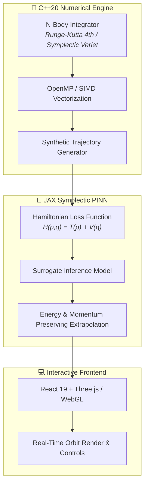

# 🪐 OrbiSim-3D: High-Performance N-Body Orbital Engine & Symplectic PINNs Surrogate

[](https://opensource.org/licenses/MIT)
[](https://isocpp.org/)
[](https://github.com/google/jax)
[](https://threejs.org/)
[](https://github.com/moises-inc?tab=projects)

> **High-Performance Celestial Mechanics Integration Engine with Symplectic Physics-Informed Neural Networks (PINNs) and Interactive 3D WebGL Visualization.**  
> Part of **Proyecto Tennessee** (*Astroinformatics & Scientific Computing Portfolio*) by **Moisés Amundarain** (*Laboratorio LIRIA / Universidad San Sebastián*).

---

## 📌 Features & Architecture



1. **C++20 SIMD Core Engine:** Multi-threaded N-body solver supporting gravitational potentials with OpenMP vectorization.
2. **Symplectic PINN Surrogate (JAX):** Physics-Informed Neural Network enforcing conservation of angular momentum $\vec{L}$ and total Hamiltonian energy $H(q,p)$.
3. **Interactive 3D WebGL Canvas (React 19 + Three.js):** Real-time rendering of planetary orbits, Lagrange points, and orbital parameter controls directly in the browser.

---

## 🛠️ Repository Structure

```text
OrbiSim-3D/
├── cpp_core/            # C++20 High-performance integrators
│   ├── include/         # Header files for N-body & Symplectic solvers
│   ├── src/             # Core C++ source implementations
│   └── tests/           # GoogleTest unit tests
├── pinn_surrogate/      # JAX Symplectic PINN model & training scripts
│   ├── model.py         # Symplectic loss & Neural Network architecture
│   ├── train.py         # Training pipeline against C++ synthetic ground truth
│   └── tests/           # pytest unit tests for Hamiltonian conservation
├── web_ui/              # React 19 + Three.js 3D Interactive Visualization
│   ├── src/components/  # 3D Orbit Canvas & Parameter Control Panels
│   └── public/          # Assets and textures
├── AGENTS.md            # OpenCode & Agent CLI guidelines
└── README.md            # Scientific & Software documentation
```

---

## 🔬 Scientific & Mathematical Background

The gravitational $N$-body equations of motion:

$$\ddot{\vec{r}}_i = -G \sum_{j \neq i} m_j \frac{\vec{r}_i - \vec{r}_j}{\|\vec{r}_i - \vec{r}_j\|^3}$$

The Symplectic PINN loss function enforces Hamiltonian conservation:

$$\mathcal{L}_{\text{symplectic}} = \left\| \frac{\partial H}{\partial p} - \dot{q} \right\|^2 + \left\| \frac{\partial H}{\partial q} + \dot{p} \right\|^2 + \lambda_L \|\vec{L}_{\text{pred}} - \vec{L}_0\|^2$$

---

## 📜 License

Distributed under the MIT License. See `LICENSE` for more information.
